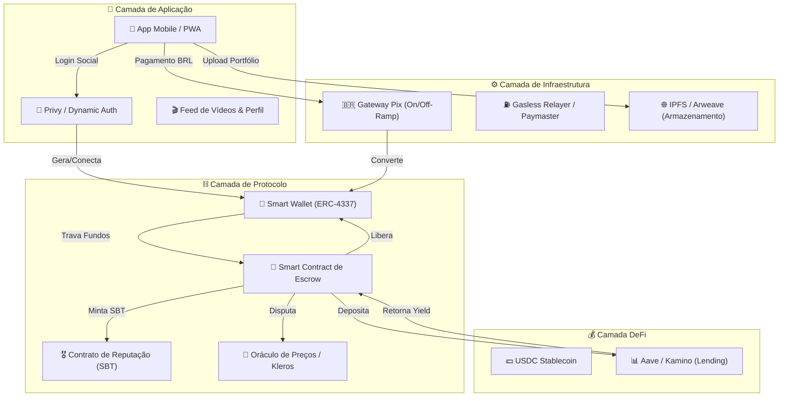
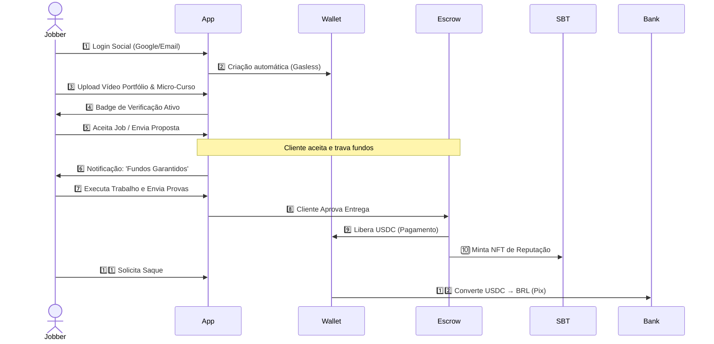
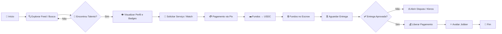
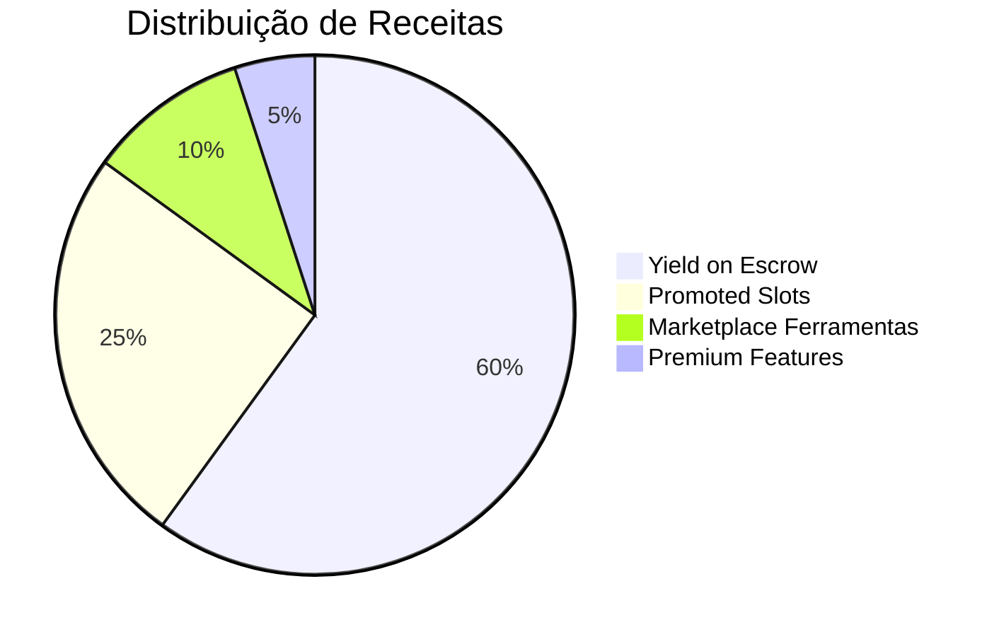
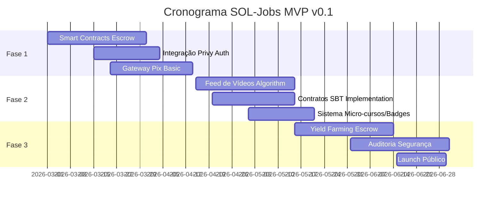

# 🔷 SOL-Jobs: O Protocolo de Liquidez de Talento e Confiança Invisível

<div align="center">


[](https://opensource.org/licenses/MIT)
[](https://docs.soliditylang.org/)
[](https://reactnative.dev/)
[](https://solana.com/)
[](https://base.org/)
[](https://aave.com/)

**Web3 Freelance Marketplace | Gig Economy Reformada | Smart Escrow + Soulbound Reputation**

*[English](./docs/README_EN.md) • [Português](./README.md)*

</div>

---

## 🚀 Resumo Executivo

O **SOL-Jobs** não é apenas um marketplace de freelancers — é uma **infraestrutura financeira descentralizada** que resolve a fricção crônica da *Gig Economy* no Brasil. Nossa tese central é a **"Web3 Invisível"**: utilizamos a tecnologia blockchain (Solana e Base) para eliminar o risco de calote e garantir liquidez imediata, enquanto a experiência do usuário (UX) permanece familiar, fluida e social (estilo TikTok/Instagram).

Ao combinar **Social Discovery** (vídeos curtos como portfólio), **Smart Escrow** (garantia matemática de pagamento) e **Reputação Imutável** (Soulbound NFTs), criamos um ecossistema onde o talento é o único colateral necessário. O modelo de negócio inova ao monetizar o *float* financeiro via DeFi (Yield on Escrow), permitindo taxas mínimas para os usuários e alinhando incentivos de longo prazo.

---

## ✨ Diferenciais do Projeto

| Feature | Descrição | Tecnologia |
|---------|-----------|------------|
| 🔒 **Smart Escrow** | Garantia matemática de pagamento com yield passivo | Solana/Base Smart Contracts |
| 🎭 **Soulbound Reputation** | Reputação imutável via SBTs intransferíveis | ERC-5192 / Solana Tokens |
| 📱 **Social Discovery** | Feed de vídeos curtos estilo TikTok como portfólio | React Native + IPFS |
| 💸 **Gasless Transactions** | Experiência sem friction de gás para usuários | ERC-4337 / Paymasters |
| 🇧🇷 **Pix Integration** | On/Off-ramp instantâneo para realidade brasileira | Gateway Pix-to-Crypto |
| 📈 **Yield on Escrow** | Capital travado gera rendimento via DeFi | Aave / Kamino Integration |

---

## 🏗️ Arquitetura Técnica



### Stack Tecnológico

| Camada | Tecnologia |
|--------|------------|
| **Frontend** | React Native + Expo, wagmi, viem, @solana/web3.js |
| **Smart Contracts** | Solidity (EVM), Rust (Solana), Anchor |
| **Autenticação** | Privy, Dynamic, WalletConnect |
| **Indexação** | The Graph, Goldsky, Helius |
| **Armazenamento** | IPFS, Arweave, Pinata |
| **DeFi** | Aave V3, Kamino, ERC-4626 Vaults |
| **Infraestrutura** | Alchemy, QuickNode, Helius RPC |

---

## 🔄 Fluxos de Usuário

### 👷 Jornada do Jobber (Prestador)



### 💼 Jornada do Cliente (Contratante)



---

## 💼 Modelo de Negócio e Tokenomics

### 📊 Revenue Streams



1. **Yield on Escrow (Receita Primária - 60%)**
   - O capital (USDC) travado nos contratos de Escrow é automaticamente alocado em protocolos DeFi (Aave/Kamino)
   - O rendimento gerado durante o período de execução do serviço (float) é retido pela plataforma
   - *Benefício:* Taxas de transação próximas de zero para usuários

2. **Tokenomics Dual**
   - **USDC (Utility):** Moeda de troca estável para previsibilidade de valor
   - **SBT (Reputation):** Tokens intransferíveis que acumulam valor social e técnico — funcionam como multiplicadores de visibilidade no algoritmo de feed

3. **Monetização Adicional**
   - **Promoted Slots:** Jobbers pagam para impulsionar vídeos no feed
   - **Marketplace de Ferramentas:** Venda de créditos para IAs e ferramentas Rabelus Lab

---

## 🗺️ Roadmap



| Fase | Timeline | Marcos |
|------|----------|--------|
| **Fase 1: Trust Core** | Mês 1-2 | ✅ Smart Contracts Escrow (Solana & Base)<br>✅ Integração Privy (Login Social)<br>✅ Gateway Pix básico (On/Off-ramp) |
| **Fase 2: Social Layer** | Mês 3-4 | 🎯 Feed de Vídeos (Algoritmo básico)<br>🎯 Contratos SBT (Soulbound Tokens)<br>🎯 Sistema Micro-cursos e Badges |
| **Fase 3: Financial Scale** | Mês 5-6 | 🚀 Yield Farming no Escrow (Aave/Kamino)<br>🚀 Auditoria de segurança completa<br>🚀 Lançamento público e Growth |

---

## 🛠️ Sugestões Técnicas para PRD

### 1. Stack de Desenvolvimento

```typescript
// Frontend Dependencies
const frontend = {
  mobile: "React Native + Expo",
  evm: ["wagmi", "viem"],
  solana: "@solana/web3.js",
  wallet: "Privy SDK"
};

// Backend/Indexação
const backend = {
  indexing: ["The Graph", "Goldsky"],
  storage: ["IPFS", "Arweave", "Pinata"],
  rpc: ["Alchemy", "QuickNode", "Helius"]
};
```

### 2. Segurança e Otimização

| Padrão | Descrição |
|--------|-----------|
| **Checks-Effects-Interactions** | Rigoroso controle no Smart Contract de Escrow para evitar ataques de reentrância |
| **Permit2 (Uniswap)** | Aprovações de tokens mais seguras para o fluxo USDC na Base |
| **Account Abstraction (ERC-4337)** | Paymasters para subsidiar gás das primeiras transações (experiência Gasless) |

### 3. Integração DeFi

- Utilizar **Vaults ERC-4626** padronizados para integração com Aave/Kamino
- Facilita a troca de estratégias de yield sem reescrever o contrato principal

---


## 📚 Documentação de Referência

> **Para o Agente Orquestrador (IA)**: Utilize esta documentação como base para planificar e implementar o App.

| Documento | Descrição | Uso Principal |
|-----------|-----------|---------------|
| [`docs/PRD.md`](./docs/PRD.md) | Especificação de Produto | Definição de features, UX/UI, roadmap técnico |
| [`docs/technical-document.html`](./docs/technical-document.html) | Documento Técnico | Arquitetura, fluxos, stack, integrações |
| [`docs/concepts-guide.md`](./docs/concepts-guide.md) | Guia de Conceitos | Explicação dos conceitos Web3 para usuários |
| [`docs/ascension-guide.md`](./docs/ascension-guide.md) | Guia de Ascensão | Como crescer na plataforma |
| [`docs/investment-deck.md`](./docs/investment-deck.md) | Proposta de Investimento | Pitch deck para investidores |
| [`docs/wireframe-original.jpg`](./docs/wireframe-original.jpg) | Wireframe Original | Rascunho inicial do projeto |

---


## 📞 Contato & Comunidade

<div align="center">

[](https://discord.gg/soljobs)
[](https://twitter.com/soljobs)
[](https://t.me/soljobs)
[](https://soljobs.com.br)

*Built with ❤️ by [Rabelus Lab](https://rabeluslab.com)*

---

**⭐ Star this repo if you like what we're building!**

</div>

---

## 📜 Licença

Este projeto está licenciado sob a licença MIT - veja o arquivo [LICENSE](LICENSE) para detalhes.

---

<div align="center">

*Made with ☀️ and Solana*


</div>
