# 🔷 SOL-Jobs: O Protocolo de Liquidez de Talento e Confiança Invisível

<div align="center">


[](https://opensource.org/licenses/MIT)
[](https://docs.soliditylang.org/)
[](https://reactnative.dev/)
[](https://solana.com/)
[](https://base.org/)
[](https://aave.com/)

**Web3 Freelance Marketplace | Gig Economy Reformada | Smart Escrow + Soulbound Reputation**

*[English](./docs/README_EN.md) • [Português](./README.md)*

</div>

---

## 🚀 Resumo Executivo

O **SOL-Jobs** não é apenas um marketplace de freelancers — é uma **infraestrutura financeira descentralizada** que resolve a fricção crônica da *Gig Economy* no Brasil. Nossa tese central é a **"Web3 Invisível"**: utilizamos a tecnologia blockchain (Solana e Base) para eliminar o risco de calote e garantir liquidez imediata, enquanto a experiência do usuário (UX) permanece familiar, fluida e social (estilo TikTok/Instagram).

Ao combinar **Social Discovery** (vídeos curtos como portfólio), **Smart Escrow** (garantia matemática de pagamento) e **Reputação Imutável** (Soulbound NFTs), criamos um ecossistema onde o talento é o único colateral necessário. O modelo de negócio inova ao monetizar o *float* financeiro via DeFi (Yield on Escrow), permitindo taxas mínimas para os usuários e alinhando incentivos de longo prazo.

---

## ✨ Diferenciais do Projeto

| Feature | Descrição | Tecnologia |
|---------|-----------|------------|
| 🔒 **Smart Escrow** | Garantia matemática de pagamento com yield passivo | Solana/Base Smart Contracts |
| 🎭 **Soulbound Reputation** | Reputação imutável via SBTs intransferíveis | ERC-5192 / Solana Tokens |
| 📱 **Social Discovery** | Feed de vídeos curtos estilo TikTok como portfólio | React Native + IPFS |
| 💸 **Gasless Transactions** | Experiência sem friction de gás para usuários | ERC-4337 / Paymasters |
| 🇧🇷 **Pix Integration** | On/Off-ramp instantâneo para realidade brasileira | Gateway Pix-to-Crypto |
| 📈 **Yield on Escrow** | Capital travado gera rendimento via DeFi | Aave / Kamino Integration |

---

## 🏗️ Arquitetura Técnica

```mermaid
graph TD
    subgraph "🎨 Camada de Aplicação"
        App["📱 App Mobile / PWA"]
        Auth["🔐 Privy / Dynamic Auth"]
        Social["🎬 Feed de Vídeos & Perfil"]
    end

    subgraph "⚙️ Camada de Infraestrutura"
        PixGateway["🇧🇷 Gateway Pix (On/Off-Ramp)"]
        Relayer["⛽ Gasless Relayer / Paymaster"]
        IPFS["🌐 IPFS / Arweave (Armazenamento)"]
    end

    subgraph "⛓️ Camada de Protocolo"
        SmartWallet["👛 Smart Wallet (ERC-4337)"]
        EscrowSC["📝 Smart Contract de Escrow"]
        SBT["🎖️ Contrato de Reputação (SBT)"]
        Oracle["🔮 Oráculo de Preços / Kleros"]
    end

    subgraph "💰 Camada DeFi"
        USDC["💵 USDC Stablecoin"]
        YieldProtocol["📊 Aave / Kamino (Lending)"]
    end

    App -->|Login Social| Auth
    Auth -->|Gera/Conecta| SmartWallet
    App -->|Upload Portfólio| IPFS
    App -->|Pagamento BRL| PixGateway
    PixGateway -->|Converte| SmartWallet
    SmartWallet -->|Trava Fundos| EscrowSC
    EscrowSC -->|Deposita| YieldProtocol
    YieldProtocol -->|Retorna Yield| EscrowSC
    EscrowSC -->|Libera| SmartWallet
    EscrowSC -->|Minta SBT| SBT
    EscrowSC -->|Disputa| Oracle
```



### Stack Tecnológico

| Camada | Tecnologia |
|--------|------------|
| **Frontend** | React Native + Expo, wagmi, viem, @solana/web3.js |
| **Smart Contracts** | Solidity (EVM), Rust (Solana), Anchor |
| **Autenticação** | Privy, Dynamic, WalletConnect |
| **Indexação** | The Graph, Goldsky, Helius |
| **Armazenamento** | IPFS, Arweave, Pinata |
| **DeFi** | Aave V3, Kamino, ERC-4626 Vaults |
| **Infraestrutura** | Alchemy, QuickNode, Helius RPC |

---

## 🔄 Fluxos de Usuário

### 👷 Jornada do Jobber (Prestador)

```mermaid
sequenceDiagram
    actor Jobber
    participant App
    participant Wallet
    participant Escrow
    participant SBT
    participant Bank

    Jobber->>App: 1️⃣ Login Social (Google/Email)
    App->>Wallet: 2️⃣ Criação automática (Gasless)
    Jobber->>App: 3️⃣ Upload Vídeo Portfólio & Micro-Curso
    App->>Jobber: 4️⃣ Badge de Verificação Ativo
    Jobber->>App: 5️⃣ Aceita Job / Envia Proposta
    Note over App,Escrow: Cliente aceita e trava fundos
    App->>Jobber: 6️⃣ Notificação: 'Fundos Garantidos'
    Jobber->>App: 7️⃣ Executa Trabalho e Envia Provas
    App->>Escrow: 8️⃣ Cliente Aprova Entrega
    Escrow->>Wallet: 9️⃣ Libera USDC (Pagamento)
    Escrow->>SBT: 🔟 Minta NFT de Reputação
    Jobber->>App: 1️⃣1️⃣ Solicita Saque
    Wallet->>Bank: 1️⃣2️⃣ Converte USDC → BRL (Pix)
```



### 💼 Jornada do Cliente (Contratante)

```mermaid
graph LR
    A[🚀 Início] --> B("🔍 Explorar Feed / Busca")
    B --> C{"🎯 Encontrou Talento?"}
    C -- Não --> B
    C -- Sim --> D["👁️ Visualizar Perfil e Badges"]
    D --> E["🤝 Solicitar Serviço / Match"]
    E --> F["💳 Pagamento via Pix"]
    F --> G["💵 Fundos → USDC"]
    G --> H["🔒 Fundos no Escrow"]
    H --> I["⏳ Aguardar Entrega"]
    I --> J{"✅ Entrega Aprovada?"}
    J -- Não --> K["⚖️ Abrir Disputa / Kleros"]
    J -- Sim --> L["💰 Liberar Pagamento"]
    L --> M["⭐ Avaliar Jobber"]
    M --> N[🎉 Fim]
```



---

## 💼 Modelo de Negócio e Tokenomics

### 📊 Revenue Streams


1. **Yield on Escrow (Receita Primária - 60%)**
   - O capital (USDC) travado nos contratos de Escrow é automaticamente alocado em protocolos DeFi (Aave/Kamino)
   - O rendimento gerado durante o período de execução do serviço (float) é retido pela plataforma
   - *Benefício:* Taxas de transação próximas de zero para usuários

2. **Tokenomics Dual**
   - **USDC (Utility):** Moeda de troca estável para previsibilidade de valor
   - **SBT (Reputation):** Tokens intransferíveis que acumulam valor social e técnico — funcionam como multiplicadores de visibilidade no algoritmo de feed

3. **Monetização Adicional**
   - **Promoted Slots:** Jobbers pagam para impulsionar vídeos no feed
   - **Marketplace de Ferramentas:** Venda de créditos para IAs e ferramentas Rabelus Lab

---

## 🗺️ Roadmap

```mermaid
gantt
    title Cronograma SOL-Jobs MVP v0.1
    dateFormat  YYYY-MM-DD
    section Fase 1
    Smart Contracts Escrow       :a1, 2026-03-01, 30d
    Integração Privy Auth         :a2, 2026-03-15, 20d
    Gateway Pix Basic             :a3, 2026-03-20, 25d
    section Fase 2
    Feed de Vídeos Algorithm      :b1, 2026-04-15, 30d
    Contratos SBT Implementation  :b2, 2026-04-20, 25d
    Sistema Micro-cursos/Badges   :b3, 2026-05-01, 20d
    section Fase 3
    Yield Farming Escrow          :c1, 2026-05-15, 30d
    Auditoria Segurança           :c2, 2026-06-01, 30d
    Launch Público                :c3, 2026-06-15, 15d
```



| Fase | Timeline | Marcos |
|------|----------|--------|
| **Fase 1: Trust Core** | Mês 1-2 | ✅ Smart Contracts Escrow (Solana & Base)<br>✅ Integração Privy (Login Social)<br>✅ Gateway Pix básico (On/Off-ramp) |
| **Fase 2: Social Layer** | Mês 3-4 | 🎯 Feed de Vídeos (Algoritmo básico)<br>🎯 Contratos SBT (Soulbound Tokens)<br>🎯 Sistema Micro-cursos e Badges |
| **Fase 3: Financial Scale** | Mês 5-6 | 🚀 Yield Farming no Escrow (Aave/Kamino)<br>🚀 Auditoria de segurança completa<br>🚀 Lançamento público e Growth |

---

## 🛠️ Sugestões Técnicas para PRD

### 1. Stack de Desenvolvimento

```typescript
// Frontend Dependencies
const frontend = {
  mobile: "React Native + Expo",
  evm: ["wagmi", "viem"],
  solana: "@solana/web3.js",
  wallet: "Privy SDK"
};

// Backend/Indexação
const backend = {
  indexing: ["The Graph", "Goldsky"],
  storage: ["IPFS", "Arweave", "Pinata"],
  rpc: ["Alchemy", "QuickNode", "Helius"]
};
```

### 2. Segurança e Otimização

| Padrão | Descrição |
|--------|-----------|
| **Checks-Effects-Interactions** | Rigoroso controle no Smart Contract de Escrow para evitar ataques de reentrância |
| **Permit2 (Uniswap)** | Aprovações de tokens mais seguras para o fluxo USDC na Base |
| **Account Abstraction (ERC-4337)** | Paymasters para subsidiar gás das primeiras transações (experiência Gasless) |

### 3. Integração DeFi

- Utilizar **Vaults ERC-4626** padronizados para integração com Aave/Kamino
- Facilita a troca de estratégias de yield sem reescrever o contrato principal

---

## 📁 Estrutura do Projeto

```
SOL-Jobs/
├── 📂 contracts/              # Smart Contracts
│   ├── 📂 solana/           # Programas Anchor/Rust
│   │   ├── escrow/
│   │   └── reputation/
│   └── 📂 evm/              # Contratos Solidity (Base)
│       ├── Escrow.sol
│       ├── SoulboundToken.sol
│       └──interfaces/
├── 📂 frontend/              # Aplicação Mobile
│   ├── 📂 src/
│   │   ├── 📂 screens/
│   │   ├── 📂 components/
│   │   ├── 📂 hooks/
│   │   └── 📂 services/
│   └── 📂 app.json
├── 📂 backend/               # API & Indexers
│   ├── 📂 api/
│   └── 📂 indexers/
├── 📂 docs/                  # Documentação
├── 📂 scripts/               # Scripts de deploy
└── 📂 tests/                 # Testes
```

---

## 🤝 Como Contribuir

```bash
# Clone o repositório
git clone https://github.com/rabelojunior81-collab/SOL-Jobs.git

# Entre no diretório
cd SOL-Jobs

# Instale dependências
npm install

# Execute o desenvolvimento
npm run dev
```

### Guidelines

1. 📖 Leia nosso [Code of Conduct](./CODE_OF_CONDUCT.md)
2. 🔀 Crie uma branch para sua feature (`git checkout -b feature/AmazingFeature`)
3. ✅ Faça commit das mudanças (`git commit -m 'Add some AmazingFeature'`)
4. 📤 Push para a branch (`git push origin feature/AmazingFeature`)
5. 🔃 Abra um Pull Request

---

## 📞 Contato & Comunidade

<div align="center">

[](https://discord.gg/soljobs)
[](https://twitter.com/soljobs)
[](https://t.me/soljobs)
[](https://soljobs.com.br)

*Built with ❤️ by [Rabelus Lab](https://rabeluslab.com)*

---

**⭐ Star this repo if you like what we're building!**

</div>

---

## 📜 Licença

Este projeto está licenciado sob a licença MIT - veja o arquivo [LICENSE](LICENSE) para detalhes.

---

<div align="center">

*Made with ☀️ and Solana*


</div>
